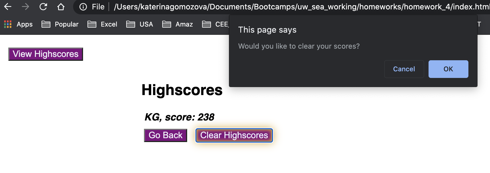

# JavaScript Coding Quiz
This repository contains the solution for the homework assignment for unit 4 of UW Coding Bootcamp. 

# Task
The goal of the task was to develop a web application for a timed coding quiz with multiple-choice questions. This app will run in the browser, and will feature dynamically updated HTML and CSS powered by JavaScript code. 
No starter code was provided. HTML, CSS and JavaScript files should have been developed from scratch. The following behavior was expected:

* When the user clicks the start button, they are presented with a question and a list of questions and the timer starts. When the selected answer is clicked, the user can see if the answer was correct or not and is presented with the next question. If the answer is incorrect, time (10 seconds) is subtracted from the clock. When all the questions are answered or the timer reaches 0, the game stops. The final score is calculated as the number of points earned multiplied by the time left. The user can save initials and score. Then the user can clear the scores or go back to the start page.

# URL to a live page
Link to a live page: https://kgo87.github.io/coding_quiz/ 

# Project Summary
The folder contains  *.html* and  *.css*, *.js* files and supplemental screenshots.
## HTML code
HTML file was structured to have a header containing the scores button and the timer, and the main body, storing all other elements of the quiz game. The structure of the page is shown below:

## JS code
* At first I created lists of questions, answers and indecies for the correct answers

* Then I created a set of variables both those that select HTML selectors, and those required for multiple different functions (timer, score, etc) 

* Then I developed different functions to implement required functionality, and assigned eventListeners that would call those functions

# Finished product
Here are several screenshots showing the functionality of the developed coding quiz game
Starting page:

List of questions:

Earned scores:

Clearing scores:

